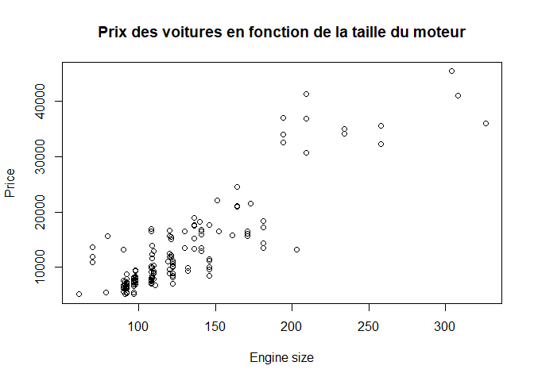
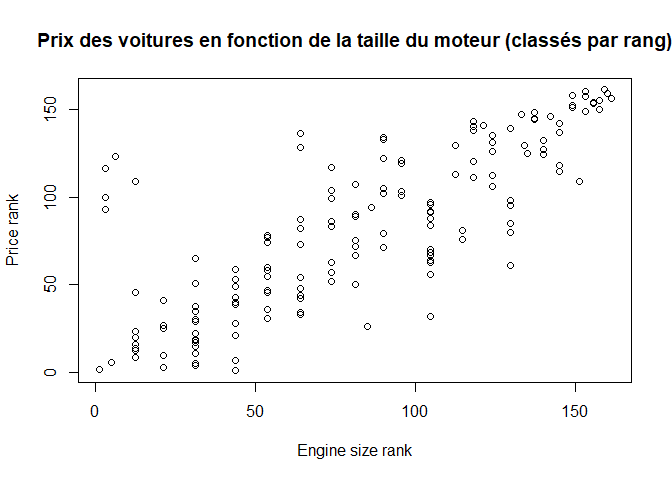
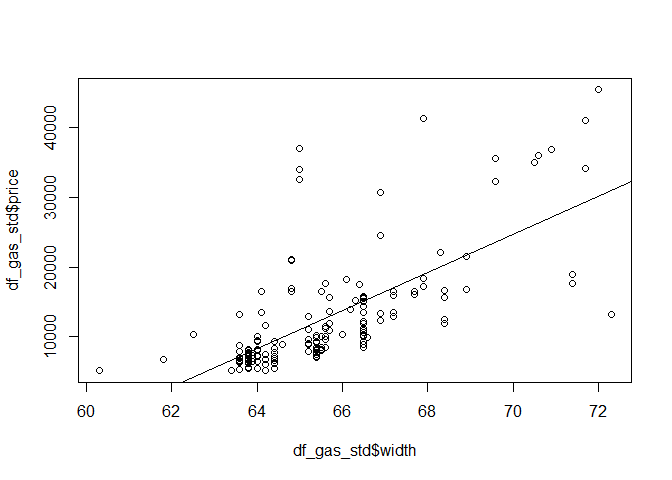
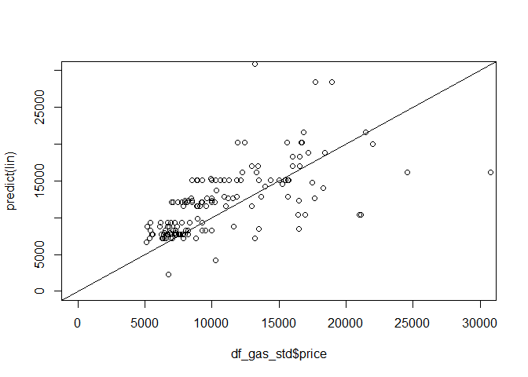
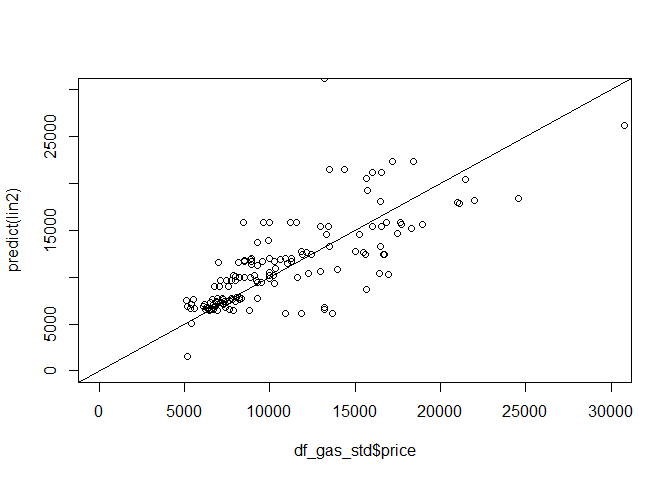

Question 1
----------

##### Si ce n’est pas déjà fait, installer le package « xlsx ». Le charger par la suite (library).

    library(xlsx)

Question 2
----------

##### Charger le fichier « autos.xlsx » (read.xlsx)

    #df_all <- read.xlsx(file="Autos.xlsx",sheetIndex=1,header=TRUE,encoding="UTF-8")
    df_all <- read.xlsx(file="S:/01 - Remise à niveau/03 - Introduction à R/Autos.xlsx",sheetIndex=1,header=TRUE)

Question 3
----------

##### Combien y a-t-il de variables dans le fichier ? Combien y a-t-il d’observations ? (ncol, nrow)

    print(ncol(df_all))

    ## [1] 19

    print(nrow(df_all))

    ## [1] 205

Il y a 19 variables dans le fichier et 205 observations.

Question 4
----------

##### Isolez dans un nouveau data frame les véhicules correspondant aux caractéristiques « fuel type = gas » et « aspiration = std ». Combien d’observations correspondent à ces caractéristiques ? (161 observations).

    df_gas_std <- df_all[df_all$fuel.type =="gas" & df_all$aspiration =="std",]
    nrow(df_gas_std)

    ## [1] 161

Il y a 161 observations avec les caractéristiques sélectionnées.

Question 5
----------

##### Créez le graphique « nuage de points » avec en abscisse « engine size » et en ordonnée « price » (plot). Que constatez-vous ?

    plot(df_gas_std$engine.size,df_gas_std$price,main="Prix des voitures en fonction de la taille du moteur",xlab="Engine size",ylab="Price")

 Les observations
semblent être corrélées suivant une régression linéaire positive. Plus
la taille du moteur augmente, plus le prix augmente.

Question 6
----------

##### Calculez le coefficient de corrélation entre ces deux variables (cor).

    cor(df_gas_std$engine.size,df_gas_std$price)

    ## [1] 0.8750252

Le coefficient de corrélation entre “engine.size” et “price” est de
0.875, ce qui prouve qu’il y a une bonne corrélation linéaire entre les
deux variables.

Question 7
----------

##### Transformez les 2 variables en rangs (rank). Refaites le graphique puis calculez le coefficient de corrélation. Commentaires ?

    rank_engine.size <- rank(df_gas_std$engine.size)
    rank_price <- rank(df_gas_std$price)
    plot(rank_engine.size,rank_price,main="Prix des voitures en fonction de la taille du moteur (classés par rang)",xlab="Engine size rank",ylab="Price rank")

    cor(rank_engine.size,rank_price)

    ## [1] 0.7888679

Le coefficient de corrélation calculé avec les données ordonnées par
rang est de 0.789, inférieur à celui calculé avec les données brutes
égal à 0.875. Il y a une “perte d’information” en utilisant les données
ordonnées par rapport aux données nominales brutes. Il n’y a plus
d’information sur la distance entre 2 observations en utilisant les
rangs ce qui dégrade le coefficient de corrélation.

Question 8
----------

##### Revenons sur les variables non transformées. Réalisez maintenant la régression linéaire simple de « price - Y » en fonction de « width - X » (Y = a X + b) (lm). Quelles valeurs des coefficients a et b obtenez-vous ? Les afficher explicitement en accédant à la propriété « coefficients » de l’objet.

    lin <- lm(df_gas_std$price ~ df_gas_std$width)
    lin$coefficients

    ##      (Intercept) df_gas_std$width 
    ##      -166375.274         2728.459

On calcule les coefficients de la régression linéaire entre le prix
(“price”) et la largeur des véhicules (“width”). Nous obtenons les
valeurs suivantes a = 2728 et b = -166375.

Question 9
----------

##### Faire afficher le coefficient de détermination R² de la régression en appelant la fonction summary(). La régression est-elle satisfaisante ?

    summary(lin)

    ## 
    ## Call:
    ## lm(formula = df_gas_std$price ~ df_gas_std$width)
    ## 
    ## Residuals:
    ##      Min       1Q   Median       3Q      Max 
    ## -17685.2  -2972.6  -1117.1    682.7  26053.4 
    ## 
    ## Coefficients:
    ##                   Estimate Std. Error t value Pr(>|t|)    
    ## (Intercept)      -166375.3    14742.6  -11.29   <2e-16 ***
    ## df_gas_std$width    2728.5      224.5   12.15   <2e-16 ***
    ## ---
    ## Signif. codes:  0 '***' 0.001 '**' 0.01 '*' 0.05 '.' 0.1 ' ' 1
    ## 
    ## Residual standard error: 5916 on 159 degrees of freedom
    ## Multiple R-squared:  0.4815, Adjusted R-squared:  0.4782 
    ## F-statistic: 147.7 on 1 and 159 DF,  p-value: < 2.2e-16

Le coefficient de détermination R² de la régression est de 0.4815.
Autrement dit, 48% de la régression peut être expliquée par la variable
“width”, il manque plus de la moitié de l’explicatif ce qui est
insuffisant.

Question 10
-----------

##### Créer le graphique « nuage de points » entre « width » (abscisse) et « price » (ordonnée). Ajouter la droite de régression dans le graphique (abline)

    plot(df_gas_std$width,df_gas_std$price)
    abline(lin)

Question 11
-----------

##### Calculer les prédictions du modèle sur les 161 véhicules constituant la base filtrée (predict). Afficher le graphique avec en abscisse les valeurs observées de « price » et en ordonnée les valeurs prédites par le modèle. Tracer une droite sur la diagonale principale pour situer la qualité de la prédiction.Attention, mettez les mêmes limites en abscisse et ordonnée pour que le graphique soit carré (cf. les options de plot)

    plot(df_gas_std$price,predict(lin), xlim=c(0,30000), ylim=c(0,30000))
    abline(a=0,b=1)

Question 12
-----------

##### Sur la même base, coder « num.of.doors » en variable binaire avec 1 quand num.of.doors == « four », et 0 quand num.of.doors == « two » (ifelse)

    num_of_doors_bin <- ifelse(df_gas_std$num.of.doors == "four",1,0)
    df_gas_std <- cbind(df_gas_std,num_of_doors_bin)

Question 13
-----------

##### On souhaite réaliser une régression linéaire multiple expliquant le « price » en fonction de « engine.size », « horsepower », « width » et la nouvelle variable nombre de portes recodée en 0/1. Reproduire les étapes (8, 9, 11). La régression est-elle de meilleure qualité ?

    # Paramétrage de la régression linéraire avec variables multiples
    lin2 <- lm(df_gas_std$price ~ df_gas_std$width + df_gas_std$engine.size + df_gas_std$horsepower + df_gas_std$num_of_doors_bin)
    lin2$coefficients

    ##                 (Intercept)            df_gas_std$width 
    ##                -22910.81022                   251.07544 
    ##      df_gas_std$engine.size       df_gas_std$horsepower 
    ##                   120.51858                    40.16346 
    ## df_gas_std$num_of_doors_bin 
    ##                  -153.42950

    # Affichage du R2
    summary(lin2)

    ## 
    ## Call:
    ## lm(formula = df_gas_std$price ~ df_gas_std$width + df_gas_std$engine.size + 
    ##     df_gas_std$horsepower + df_gas_std$num_of_doors_bin)
    ## 
    ## Residuals:
    ##      Min       1Q   Median       3Q      Max 
    ## -18067.2  -1890.5   -297.4   1512.3  14679.7 
    ## 
    ## Coefficients:
    ##                              Estimate Std. Error t value Pr(>|t|)    
    ## (Intercept)                 -22910.81   14357.26  -1.596   0.1126    
    ## df_gas_std$width               251.08     235.66   1.065   0.2883    
    ## df_gas_std$engine.size         120.52      15.35   7.853 6.14e-13 ***
    ## df_gas_std$horsepower           40.16      16.54   2.428   0.0163 *  
    ## df_gas_std$num_of_doors_bin   -153.43     657.12  -0.233   0.8157    
    ## ---
    ## Signif. codes:  0 '***' 0.001 '**' 0.01 '*' 0.05 '.' 0.1 ' ' 1
    ## 
    ## Residual standard error: 3906 on 156 degrees of freedom
    ## Multiple R-squared:  0.7782, Adjusted R-squared:  0.7725 
    ## F-statistic: 136.8 on 4 and 156 DF,  p-value: < 2.2e-16

    # Affichage des prédictions du modèle
    plot(df_gas_std$price,predict(lin2), xlim=c(0,30000), ylim=c(0,30000))
    abline(a=0,b=1)

 On réalise cette
fois une régression linéaire avec multiples variables. On re-calcule les
coefficients de cette nouvelle régression. Le nouveau coefficient de
détermination R² de la régression est de 0.7782 ce qui est bien meilleur
que celui de la simple régression linéaire (pour mémoire 0.4815). On
constate sur le graphique que les points sont plus rapprochés de la
diagonale, ce qui va dans le sens d’une régression plus satisfaisante
que précédemment.
